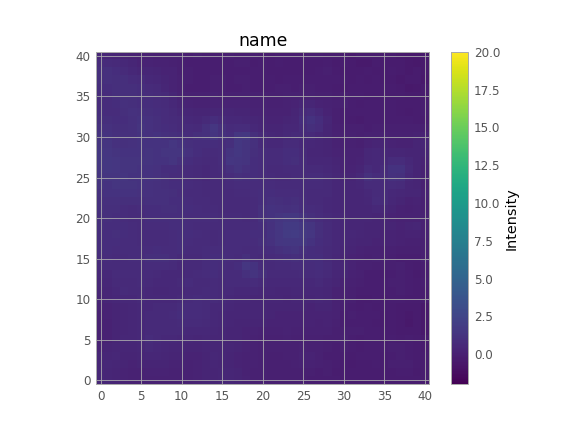
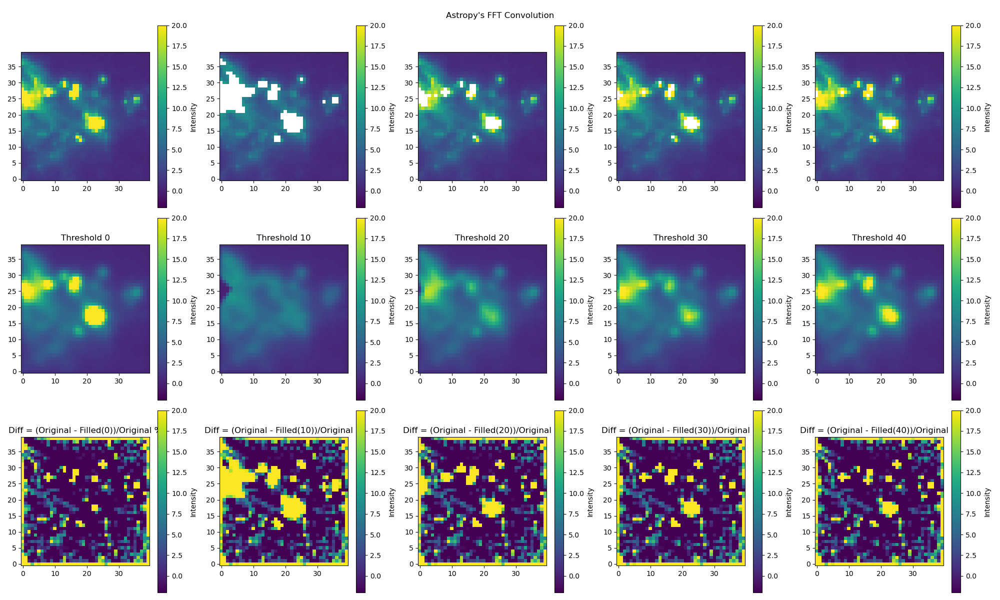
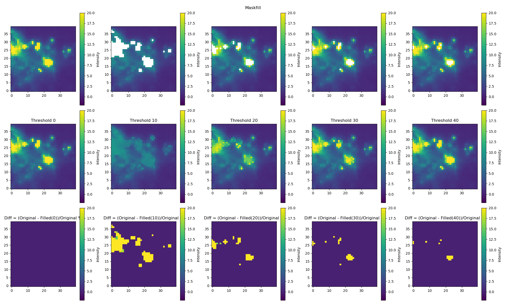

# Table of Contents

1.  [Callable functions](#org39644d3)
2.  [The files](#orgf0ba5df)
    1.  [The astropy data](#org5b93ef0)
3.  [Astropy Convolution](#orgfa7f165)
    1.  [Astropy Fast Fourier Transform (FFT).](#org006e4b1)
4.  [Python Maskfill](#orgf9ea5ab)
5.  [R-INLA](#orgbdbf2dd)
6.  [Comparisons](#org4cf954e)
    1.  [Astropy conv](#org41f54b7)
    2.  [Astropy fft](#org457c23a)
    3.  [Maskfill](#org11e2906)

Here I will compare 3 methods of filling missing data of FITS files.

1.  Astropy&rsquo;s Convolution
2.  Python&rsquo;s Maskfill method
3.  R-INLA

# Callable functions

    import numpy as np
    threshold = np.arange(0,50,10)
    return threshold

    import matplotlib.pyplot as plt
    import numpy as np
    from astropy.io import fits
    from astropy.visualization import astropy_mpl_style
    
    
    fig, axes = plt.subplots(3, 5, figsize=(20, 12))  # Adjust the number of subplots as needed
    
    # Iterate over different thresholds
    for idx, i in enumerate(threshold):
        filename = "{}/filled_{}.fits".format(path,i)
    
        # Load the image data
        img_data_filled = fits.getdata(filename)
    
        # Plot the image
        ax = axes[0,idx]
        im = ax.imshow(img_data_filled, cmap='viridis', origin='lower', vmin=-2.0, vmax=20.0)
        ax.set_title("Threshold {}".format(i))
        plt.colorbar(im, ax=ax, orientation='vertical', label='Intensity')
    ######### Iterate over different thresholds for the second row of subplots
        filename = "galactic_center_masked_{}.fits".format(i)
    
        # Load the image data
        img_data_masked = fits.getdata(filename)
    
        # Plot the image on the second row
        ax = axes[1, idx]
        im = ax.imshow(img_data_masked, cmap='viridis', origin='lower', vmin=-2.0, vmax=20.0)
        plt.colorbar(im, ax=ax, orientation='vertical', label='Intensity')
    
    ######### Iterate over different diffs for the third row of subplots
        filename = "{}/diffs_{}.fits".format(path,i)
    
        # Load the original image data
        original = fits.getdata("galactic_center.fits")
    
        img_diffs = original - img_data_filled
    
        # Plot the image on the second row
        ax = axes[2, idx]
        im = ax.imshow(img_diffs, cmap='viridis', origin='lower', vmin=-2.0, vmax=20.0)
        ax.set_title("Diff = Original - Filled({})".format(i))
        plt.colorbar(im, ax=ax, orientation='vertical', label='Intensity')
    ######### Save the Diffs
        hdu = fits.PrimaryHDU(img_diffs)
    
        hdu.writeto(filename,overwrite = True)
    
    # Adjust layout and display the figure
    fig.suptitle("{}".format(title))
    plt.tight_layout()
    filename = "visualizations/{}".format(title)
    plt.savefig(filename)
    plt.close()
    
    print("[[./"+filename+".png]]")

    import numpy as np
    from skimage.metrics import structural_similarity as ssim
    from astropy.io import fits
    import pandas as pd
    import matplotlib.pyplot as plt
    
    # Load the FITS images for the masked images
    masked_images = [fits.getdata('{}/filled_{}.fits'.format(path,i)) for i in np.arange(0, 50, 10)]
    
    # Load the corresponding original images
    original_images = fits.getdata(f'galactic_center.fits')
    
    filel = "galactic_center.fits"
    
    # Calculate MSE and SSIM for each comparison
    mse_values = [np.mean((original_images - masked_images[i]) ** 2) for i in range(len(masked_images))]
    ssim_values = [ssim(original_images, masked_images[i], data_range=original_images.max() - original_images.min()) for i in range(len(masked_images))]
    
    # Create a DataFrame to store the results
    data = {'Comparison': np.arange(0, 50, 10),
            'MSE': mse_values,
            'SSIM': ssim_values}
    df = pd.DataFrame(data)

# The files

## The astropy data

I will use the data from data.astropy.org. The reason for this is that we have a dense non homogeneous image and it will be good for testing

    import matplotlib.pyplot as plt
    import numpy as np
    from astropy.convolution import Gaussian2DKernel, convolve
    from astropy.io import fits
    from astropy.utils.data import get_pkg_data_filename
    from scipy.ndimage import convolve as scipy_convolve
    
    # Load the data from data.astropy.org
    filename = get_pkg_data_filename('galactic_center/gc_msx_e.fits')
    hdul = fits.open(filename)
    
    hdul.info()
    data = hdul[0].data
    
    zoom = data[50:90, 60:100] * 1e5
    
    
    hdul_1 = fits.PrimaryHDU(zoom)
    hdul_1.writeto("galactic_center.fits",overwrite = True)
    
    hdul.close()

Scale the file to have reasonable numbers (this is mostly so that colorbars do not have too many digits). Also, we crop it so you can see individual pixels

Then we can mask it by setting the brightest pixels to NaN

    for i in threshold:
        img = zoom.copy()
        if i > 0:
            img[img > i] = np.nan
        hdu = fits.PrimaryHDU(img)
        filename = "galactic_center_masked_{}.fits".format(i)
        hdu.writeto(filename,overwrite = True)
    
    
    ig, axes = plt.subplots(1, len(threshold), figsize=(20, 4))  # Adjust the number of subplots as needed
    
    # Iterate over different thresholds
    for idx, i in enumerate(np.arange(0, 50, 10)):
        filename = "galactic_center_masked_{}.fits".format(i)
    
        # Load the image data
        img_data = fits.getdata(filename)
    
        # Plot the image
        ax = axes[idx]
        im = ax.imshow(img_data, cmap='viridis', origin='lower', vmin=-2.0, vmax=20.0)
        ax.set_title("Threshold {}".format(i))
        plt.colorbar(im, ax=ax, orientation='vertical', label='Intensity')
    
    # Adjust layout and display the figure
    plt.tight_layout()
    filename = "visualizations/masked_fits"
    plt.savefig(filename)
    plt.close()
    
    filename+".png"

# Astropy Convolution

    import numpy as np
    import matplotlib.pyplot as plt
    from astropy.convolution import Gaussian2DKernel, convolve
    from astropy.io import fits
    from scipy.ndimage import convolve as scipy_convolve
    import os
    
    mypath = "astropy_conv"
    
    if not os.path.exists(mypath):
        os.mkdir(mypath)

We smooth with a Gaussian kernel with xstddev=1 (and ystddev=1). It is a 9x9 array.
Astropy&rsquo;s convolution replaces the NaN pixels with a kernel-weighted interpolation from their neighbors

    for i in threshold:
        data = fits.open("galactic_center_masked_{}.fits".format(i))[0].data
    
        kernel = Gaussian2DKernel(x_stddev=1)
        astropy_conv = convolve(data, kernel)
    
        hdu = fits.PrimaryHDU(astropy_conv)
    
        hdu.writeto("astropy_conv/filled_{}.fits".format(i),overwrite = True)

<table border="2" cellspacing="0" cellpadding="6" rules="groups" frame="hsides">

<colgroup>
<col  class="org-right" />

<col  class="org-right" />

<col  class="org-right" />

<col  class="org-right" />
</colgroup>
<thead>
<tr>
<th scope="col" class="org-right">&#xa0;</th>
<th scope="col" class="org-right">Comparison</th>
<th scope="col" class="org-right">MSE</th>
<th scope="col" class="org-right">SSIM</th>
</tr>
</thead>

<tbody>
<tr>
<td class="org-right">0</td>
<td class="org-right">0.0</td>
<td class="org-right">41.31836383457224</td>
<td class="org-right">0.9542151726989633</td>
</tr>

<tr>
<td class="org-right">1</td>
<td class="org-right">10.0</td>
<td class="org-right">175.0253853352854</td>
<td class="org-right">0.8284485435865382</td>
</tr>

<tr>
<td class="org-right">2</td>
<td class="org-right">20.0</td>
<td class="org-right">156.0987621112356</td>
<td class="org-right">0.8674916390963295</td>
</tr>

<tr>
<td class="org-right">3</td>
<td class="org-right">30.0</td>
<td class="org-right">146.6109666965225</td>
<td class="org-right">0.8866031019110286</td>
</tr>

<tr>
<td class="org-right">4</td>
<td class="org-right">40.0</td>
<td class="org-right">135.1704353934664</td>
<td class="org-right">0.9033264570664562</td>
</tr>
</tbody>
</table>

## Astropy Fast Fourier Transform (FFT).

This is much more efficient for larger kernels.

    import numpy as np
    import matplotlib.pyplot as plt
    from astropy.convolution import Gaussian2DKernel, convolve_fft
    from astropy.io import fits
    from scipy.ndimage import convolve as scipy_convolve
    import os
    
    mypath = "astropy_fft"
    
    if not os.path.exists(mypath):
        os.mkdir(mypath)
    
    for i in threshold:
        data = fits.open("galactic_center_masked_{}.fits".format(i))[0].data
    
        kernel = Gaussian2DKernel(x_stddev=1)
        astropy_conv = convolve(data, kernel)
    
        hdu = fits.PrimaryHDU(astropy_conv)
    
        hdu.writeto("astropy_fft/filled_{}.fits".format(i),overwrite = True)

<table border="2" cellspacing="0" cellpadding="6" rules="groups" frame="hsides">

<colgroup>
<col  class="org-left" />
</colgroup>
<tbody>
<tr>
<td class="org-left">&#xa0;</td>
</tr>
</tbody>
</table>

# Python Maskfill

    import subprocess
    
    def run_poetry_command(command):
        try:
            result = subprocess.run(command, shell=True, capture_output=True, text=True)
            if result.returncode == 0:
                return result.stdout
            else:
                return result.stderr
        except Exception as e:
            return str(e)
    
    # Example: Install dependencies
    install_command = "poetry install"
    install_output = run_poetry_command(install_command)
    print(install_output)
    
    # Example: Add a package
    add_command = "poetry add package_name"
    add_output = run_poetry_command(add_command)
    print(add_output)
    
    # Example: Run a Python script using Poetry
    run_script_command = "poetry run python my_script.py"
    run_script_output = run_poetry_command(run_script_command)
    print(run_script_output)

    from astropy.io import fits
    import numpy as np
    from maskfill import maskfill #download from github NOT pip
    import matplotlib.pyplot as plt
    from astropy.visualization import astropy_mpl_style
    
    for i in x:
        hdul = fits.open("galactic_center_masked_{}.fits".format(i))
        # Get the data from the FITS file
        data = hdul[0].data
    
        # Create a masked array from the data, masking NaN values
        masked_data = np.ma.masked_invalid(data)
    
        # Access the mask array
        mask_array = masked_data.mask
    
        maskfill.maskfill(data, mask_array,writesteps=False,output_file='maskfilled/filled_{}.fits'.format(i),verbose=True)

<table border="2" cellspacing="0" cellpadding="6" rules="groups" frame="hsides">

<colgroup>
<col  class="org-right" />

<col  class="org-right" />

<col  class="org-right" />

<col  class="org-right" />
</colgroup>
<thead>
<tr>
<th scope="col" class="org-right">&#xa0;</th>
<th scope="col" class="org-right">Comparison</th>
<th scope="col" class="org-right">MSE</th>
<th scope="col" class="org-right">SSIM</th>
</tr>
</thead>

<tbody>
<tr>
<td class="org-right">0</td>
<td class="org-right">0.0</td>
<td class="org-right">0.0</td>
<td class="org-right">1.0</td>
</tr>

<tr>
<td class="org-right">1</td>
<td class="org-right">10.0</td>
<td class="org-right">169.59955577168992</td>
<td class="org-right">0.8406528055948019</td>
</tr>

<tr>
<td class="org-right">2</td>
<td class="org-right">20.0</td>
<td class="org-right">150.39562244550564</td>
<td class="org-right">0.8853538258497918</td>
</tr>

<tr>
<td class="org-right">3</td>
<td class="org-right">30.0</td>
<td class="org-right">140.01027954791735</td>
<td class="org-right">0.9101794531835622</td>
</tr>

<tr>
<td class="org-right">4</td>
<td class="org-right">40.0</td>
<td class="org-right">125.39866935548982</td>
<td class="org-right">0.9334534610339772</td>
</tr>
</tbody>
</table>

# R-INLA

    # Load necessary packages
    library(INLA)
    library(FITSio)
    # Read fits image
    fits_data <- readFITS("galactic_center.fits")
    
    # Define spatial mesh
    x <- seq(1, ncol(fits_data))
    y <- seq(1, nrow(fits_data)
    
    mesh <- inla.mesh.2d(x, y, max.n = 10, cutoff = cutoff)
    
    # Define model
    formula <- observed_data ~ f(mesh, model = "rw2")
    
    # Define likelihood
    likelihood <- "gaussian"
    
    # Fit the model
    fit <- inla(formula, data = list(observed_data = fits_data),
                control.predictor = list(compute = TRUE),
                control.inla = list(strategy = "adaptive"))
    
    # Posterior prediction
    predicted_image <- fitted(fit)

# Comparisons

1.  ****Mean Squared Error (MSE)****:
    -   Mean Squared Error is a commonly used metric to measure the average squared difference between the original and the masked images. It quantifies the average of the squares of the errors or deviations. A lower MSE value indicates a closer resemblance between the two images.
    -   The formula for MSE between two images A and B, each with dimensions $m \times n$, is:
        
        $$
             MSE = \frac{1}{mn} \sum_{i=0}^{m-1} \sum_{j=0}^{n-1} (A_{ij} - B_{ij})^2
             $$

2.  ****Structural Similarity Index (SSIM)****:
    -   SSIM is a perception-based metric that measures the similarity between two images. It considers luminance, contrast, and structure. Unlike MSE, SSIM takes into account the structure of the images, making it more suitable for assessing perceptual differences.
    -   The SSIM index ranges from -1 to 1, where 1 indicates perfect similarity. Typically, a value above 0.9 is considered a good match.
    -   The SSIM index formula involves comparisons between local neighborhoods of the images&rsquo; pixels. The formula for SSIM index between images A and B is:
        
        $$
             SSIM(A, B) = \frac{(2 \mu_A \mu_B + C_1)(2 \sigma_{AB} + C_2)}{(\mu_A^2 + \mu_B^2 + C_1)(\sigma_A^2 + \sigma_B^2 + C_2)}
             $$
        
        Here,
        
        -   $\mu_A$ and $\mu_B$ are the means of images A and B,
        -   $\sigma_A^2$ and $\sigma_B^2$ are the variances of images A and B,
        -   $\sigma_{AB}$ is the covariance of images A and B,
        -   $C_1$ and $C_2$ are small constants to prevent division by zero errors and stabilize the division, and
        -   $L$ is the dynamic range of pixel values (typically $2^{\text{bitdepth}} - 1$ for images with bit depth).

## Astropy conv

<table border="2" cellspacing="0" cellpadding="6" rules="groups" frame="hsides">

<colgroup>
<col  class="org-right" />

<col  class="org-right" />

<col  class="org-right" />

<col  class="org-right" />
</colgroup>
<thead>
<tr>
<th scope="col" class="org-right">&#xa0;</th>
<th scope="col" class="org-right">Comparison</th>
<th scope="col" class="org-right">MSE</th>
<th scope="col" class="org-right">SSIM</th>
</tr>
</thead>

<tbody>
<tr>
<td class="org-right">0</td>
<td class="org-right">0.0</td>
<td class="org-right">41.31836383457224</td>
<td class="org-right">0.9542151726989633</td>
</tr>

<tr>
<td class="org-right">1</td>
<td class="org-right">10.0</td>
<td class="org-right">175.0253853352854</td>
<td class="org-right">0.8284485435865382</td>
</tr>

<tr>
<td class="org-right">2</td>
<td class="org-right">20.0</td>
<td class="org-right">156.0987621112356</td>
<td class="org-right">0.8674916390963295</td>
</tr>

<tr>
<td class="org-right">3</td>
<td class="org-right">30.0</td>
<td class="org-right">146.6109666965225</td>
<td class="org-right">0.8866031019110286</td>
</tr>

<tr>
<td class="org-right">4</td>
<td class="org-right">40.0</td>
<td class="org-right">135.1704353934664</td>
<td class="org-right">0.9033264570664562</td>
</tr>
</tbody>
</table>

## Astropy fft

<table border="2" cellspacing="0" cellpadding="6" rules="groups" frame="hsides">

<colgroup>
<col  class="org-right" />

<col  class="org-right" />

<col  class="org-right" />

<col  class="org-right" />
</colgroup>
<thead>
<tr>
<th scope="col" class="org-right">&#xa0;</th>
<th scope="col" class="org-right">Comparison</th>
<th scope="col" class="org-right">MSE</th>
<th scope="col" class="org-right">SSIM</th>
</tr>
</thead>

<tbody>
<tr>
<td class="org-right">0</td>
<td class="org-right">0.0</td>
<td class="org-right">41.31836383457224</td>
<td class="org-right">0.9542151726989633</td>
</tr>

<tr>
<td class="org-right">1</td>
<td class="org-right">10.0</td>
<td class="org-right">175.0253853352854</td>
<td class="org-right">0.8284485435865382</td>
</tr>

<tr>
<td class="org-right">2</td>
<td class="org-right">20.0</td>
<td class="org-right">156.0987621112356</td>
<td class="org-right">0.8674916390963295</td>
</tr>

<tr>
<td class="org-right">3</td>
<td class="org-right">30.0</td>
<td class="org-right">146.6109666965225</td>
<td class="org-right">0.8866031019110286</td>
</tr>

<tr>
<td class="org-right">4</td>
<td class="org-right">40.0</td>
<td class="org-right">135.1704353934664</td>
<td class="org-right">0.9033264570664562</td>
</tr>
</tbody>
</table>

## Maskfill

<table border="2" cellspacing="0" cellpadding="6" rules="groups" frame="hsides">

<colgroup>
<col  class="org-right" />

<col  class="org-right" />

<col  class="org-right" />

<col  class="org-right" />
</colgroup>
<thead>
<tr>
<th scope="col" class="org-right">&#xa0;</th>
<th scope="col" class="org-right">Comparison</th>
<th scope="col" class="org-right">MSE</th>
<th scope="col" class="org-right">SSIM</th>
</tr>
</thead>

<tbody>
<tr>
<td class="org-right">0</td>
<td class="org-right">0.0</td>
<td class="org-right">0.0</td>
<td class="org-right">1.0</td>
</tr>

<tr>
<td class="org-right">1</td>
<td class="org-right">10.0</td>
<td class="org-right">169.59955577168992</td>
<td class="org-right">0.8406528055948019</td>
</tr>

<tr>
<td class="org-right">2</td>
<td class="org-right">20.0</td>
<td class="org-right">150.39562244550564</td>
<td class="org-right">0.8853538258497918</td>
</tr>

<tr>
<td class="org-right">3</td>
<td class="org-right">30.0</td>
<td class="org-right">140.01027954791735</td>
<td class="org-right">0.9101794531835622</td>
</tr>

<tr>
<td class="org-right">4</td>
<td class="org-right">40.0</td>
<td class="org-right">125.39866935548982</td>
<td class="org-right">0.9334534610339772</td>
</tr>
</tbody>
</table>

