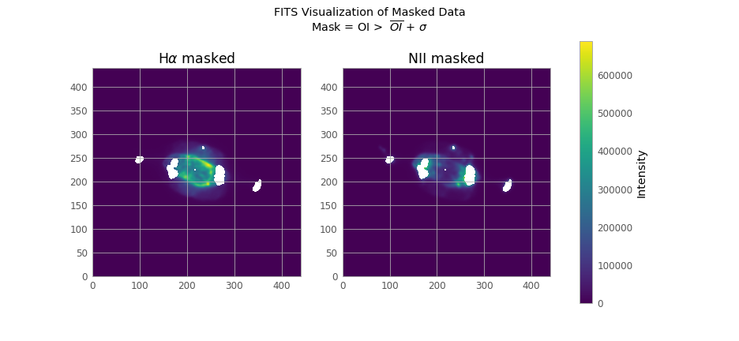
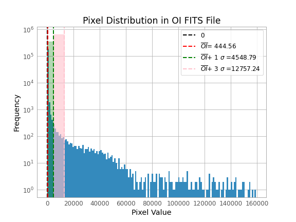

# Table of Contents

1.  [FITS files](#orga712063)
2.  [Masking the data](#orgda1062a)
    1.  [Masking condition](#org0be4b59)
    2.  [Masking the H and N data](#orgdb4deb7)
        1.  [mask0 = odata !=0](#orge810193)
        2.  [mask1 = odata > odata.mean()](#orgdd2c78d)
        3.  [mask2 = odata > oclip.std()](#orgf9d2df3)
    3.  [Pixel distribution (or &ldquo;Why the &sigma; mask is the best&rdquo;)](#org8cda2dd)
3.  [Use Maskfill](#org5628877)

    from astropy.io import fits
    import numpy as np
    from maskfill import maskfill #download from github NOT pip
    import matplotlib.pyplot as plt
    from astropy.visualization import astropy_mpl_style
    from astropy.table import Table
    from astropy.stats import sigma_clip
    
    
    def masked_hn(mask):
        h_mask = np.ma.masked_where(mask, h_data)
        n_mask = np.ma.masked_where(mask, n_data)
        return h_mask, n_mask
    
    def vis(mask,name, mask_description):
    
        fname = "visualizations/mask_" + name + ".png"
        labels=[r"H$\alpha$ masked", "NII masked"]
    
        plt.style.use(astropy_mpl_style)
        # Create a figure with 1 row and 2 columns
        fig, axs = plt.subplots(1, 2, figsize=(13, 6))
    
        for i in range(0,2):
            im = axs[i].imshow(masked_hn(mask)[i], cmap="viridis", origin='lower')
            axs[i].set_title(labels[i])
    
        fig.colorbar(im, ax=axs, orientation='vertical',label='Intensity')
        fig.suptitle("FITS Visualization of Masked Data\nMask = {}".format(mask_description))
        plt.savefig(fname)
        plt.close()
        return fname
    
    def vis_1(data, name):
    
        fname = "visualizations/" + name + ".png"
    
        plt.style.use(astropy_mpl_style)
    
        plt.imshow(data, cmap="viridis", origin='lower')
    
        plt.title("FITS Visualization of Data {}".format(name))
        plt.colorbar(orientation='vertical',label='Intensity')
        plt.savefig(fname)
        plt.close()
        return fname
    
    def fill_vis(masked, original, filled, name, mask_description):
    
        fname = "visualizations/" + name + ".png"
        labels = ["Masked", "Original", "Maskfill"]
        data = [masked, original, filled[1]]
    
        plt.style.use(astropy_mpl_style)
        # Create a figure with 1 row and 3 columns
        fig, axs = plt.subplots(1, 3, figsize=(12, 4))
    
        for i in range(0,3):
            im = axs[i].imshow(data[i] , cmap="viridis", origin='lower')
            axs[i].set_title(labels[i])
    
        fig.colorbar(im, ax=axs, orientation='vertical',label='Intensity')
        fig.suptitle("FITS Visualization of Masked Data and the Maskfill data of {}".format(mask_description))
        plt.savefig(fname)
        plt.close()
        return fname

# FITS files

    h1 = fits.open('HI_6563s.fits')
    o1 = fits.open('O1_6300s.fits')
    n2 = fits.open('N2_6583s.fits')
    
    h1.info()
    n2.info()
    o1.info()
    
    h_data = h1[0].data
    n_data = n2[0].data
    o_data = o1[0].data
    
    h1.close()
    n2.close()
    o1.close()

-   We don&rsquo;t use `fits.getdata()` because this way we can use more functions of the astropy library
-   Each FITS file has only one HDU (Header Data Unit), so we can get the data from the PrimaryHDU:

    vis_1(h_data,"HI")

    vis_1(n_data,"NI")

    vis_1(o_data,"OII")

# Masking the data

## Masking condition

I use the condition `mask = o_data > o_data.mean()`, because if we use the condition `mask = o_data !=0` we get a lot of noise asswell!

    
    # Mask condition
    masks = [o_data!=0,
             o_data > o_data.mean(),
             o_data >  o_data.mean() + o_data.std()]

## Masking the H and N data

### mask0 = odata !=0

    vis(masks[0],"0", r"OII $\ne$ 0")

<>

We have a lot of noise in our data

### mask1 = odata > odata.mean()

    vis(masks[1],"1", r"OII > $\overline{OII}$")

### mask2 = odata > oclip.std()

    vis(masks[2],"2", r"OII >  $\overline{OII}$ + $\sigma$")

## Pixel distribution (or &ldquo;Why the &sigma; mask is the best&rdquo;)

If we see the pixel distribution we can that we have a lot of &ldquo;active&rdquo; pixels in the low magnitudes of the OII. This most likely is the noise of our data and we should ignore it!

    pixel_values = o_data.flatten()

    fname = "visualizations/distr.png"
    # Create a histogram
    plt.hist(pixel_values , bins=150, log = True)
    
    plt.title('Pixel Distribution in OII FITS File')
    plt.xlabel('Pixel Value')
    plt.ylabel('Frequency')
    
    # Add vertical lines for mean and mean +/- std
    plt.axvline(0,
                color='black',
                linestyle='dashed',
                linewidth=2,
                label='0')
    
    plt.axvline(o_data.mean(),
                color='red',
                linestyle='dashed',
                linewidth=2,
                label= r'$\overline{OII}$'+'= {:.2f}'.format(o_data.mean()) )
    
    plt.axvline(o_data.mean() + o_data.std(),
                color='green',
                linestyle='dashed',
                linewidth=2,
                label=r'$\overline{OII}$+ 1 $\sigma$ ='+'{:.2f} '.format(o_data.mean() + o_data.std()))
    
    plt.fill_betweenx(y=[0, plt.gca().get_ylim()[1]],
                      x1 =0, x2 = o_data.mean() + o_data.std(),
                      color='green', alpha=0.3)
    
    plt.axvline(o_data.mean() + 3* o_data.std(),
                color='pink',
                linestyle='dashed',
                linewidth=2,
                label=r'$\overline{OII}$+ 3 $\sigma$ ='+'{:.2f} '.format(o_data.mean() + 3* o_data.std()))
    
    plt.fill_betweenx(y=[0, plt.gca().get_ylim()[1]],
                      x1 =o_data.mean() + o_data.std(), x2 = o_data.mean() + 3* o_data.std(),
                      color='pink', alpha=0.6)
    
    
    
    plt.legend()
    
    plt.savefig(fname)
    plt.close()
    fname

(maybe it is better to use 3$\sigma$)

# Use Maskfill

    h_masked = masked_hn(masks[2])[0]
    n_masked = masked_hn(masks[2])[1]
    
    h_fill = maskfill.maskfill(h_data, h_masked.mask,writesteps=False,output_file='H_fill.fits',verbose=True)
    n_fill = maskfill.maskfill(n_data, n_masked.mask,writesteps=False,output_file='N_fill.fits',verbose=True)

    fill_vis(h_masked, h_data, h_fill, "HI_fill", "HI")

    
    fill_vis(n_masked, n_data, n_fill, "NII_fill", "NII")

